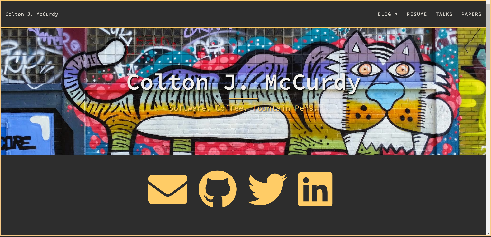

# A Customized Beautiful Hugo - A customized port of Beautiful Hugo, a port of the Beautiful Jekyll Theme



## Installation

1. [Start a Hugo project](https://gohugo.io/getting-started/quick-start/)
```bash
hugo new site your-site-name
```
2. Initialized the Git Repository
```bash
git init
```
3. "Install" the theme
```bash
git submodule add https://github.com/mccurdyc/beautifulhugo.git themes/beautifulhugo
```

4. [Update your config.* to use the theme](https://gohugo.io/themes/installing-and-using-themes/) (if using `toml` add the following)
```toml
themesDir = "themes"
theme = "beautifulhugo"
```

See [the Hugo documentation](https://gohugo.io/themes/installing/) for more information.

## Extra Features

### You can easily change the colorscheme

At the top of `static/css/main.css`, set the appropriate values for your colorscheme.

```css
:root {
  --base00: #2d2d2d;
  --base01: #393939;
  --base02: #515151;
  --base03: #747369;
  --base04: #a09f93;
  --base05: #d3d0c8;
  --base06: #e8e6df;
  --base07: #f2f0ec;
  --base08: #f2777a;
  --base09: #f99157;
  --base0a: #ffcc66;
  --base0b: #99cc99;
  --base0c: #66cccc;
  --base0d: #6699cc;
  --base0e: #cc99cc;
  --base0f: #d27b53;
}
```

_Issue: there is one known issue where the Twitter status links are hardcoded to use `#FFCC66`._

I recommend https://terminal.sexy if your colorscheme is available on there.

### Responsive

This theme is designed to look great on both large-screen and small-screen (mobile) devices.

### Syntax highlighting

This theme has support for either Hugo's lightning fast Chroma, or both server side and client side highlighting. See [the Hugo docs for more](https://gohugo.io/content-management/syntax-highlighting/).

#### Chroma - New server side syntax highlighting

To enable Chroma, add the following to your site parameters:

```
pygmentsCodeFences = true
pygmentsUseClasses = true
```

Then, you can manually edit the syntax highlighting at the bottom of `static/css/main.css`.

Or, you can generate a different style by running:

```
hugo gen chromastyles --style=trac >> static/css/main.css
```

#### Pygments - Old server side syntax highlighting

To use this feature install Pygments (`pip install Pygments`) and add the following to your site parameters:

```
pygmentsStyle = "trac"
pygmentsUseClassic = true
```

Pygments is mostly compatable with the newer Chroma. It is slower but has some additional theme options. I recommend Chroma over Pygments. Pygments will use `syntax.css` for highlighting, unless you also set the config `pygmentsUseClasses = false` which will generate the style code directly in the HTML file.

#### Highlight.js - Client side syntax highlighting
```
[Params]
    useHLJS = true
```

Client side highlighting does not require pygments to be installed. This will use `highlight.min.css` instead of `syntax.css` for highlighting (effectively disabling Chroma). Highlight.js has a wider range of support for languages and themes, and an alternative highlighting engine.

### Disqus support

To use this feature, uncomment and fill out the `disqusShortname` parameter in `config.toml`.

### Staticman support

Add *staticman* configuration section in `config.toml` or `config.yaml`

Sample `config.yaml` configuration

```
  staticman:
    api: https://api.staticman.net/v2/entry/<USERNAME>/<REPOSITORY-BLOGNAME>/master/comments
    pulls: https://github.com/<USERNAME>/<REPOSITORY-BLOGNAME>/pulls
    recaptcha:
      sitekey: "6LeGeTgUAAAAAAqVrfTwox1kJQFdWl-mLzKasV0v"
      secret: "hsGjWtWHR4HK4pT7cUsWTArJdZDxxE2pkdg/ArwCguqYQrhuubjj3RS9C5qa8xu4cx/Y9EwHwAMEeXPCZbLR9eW1K9LshissvNcYFfC/b8KKb4deH4V1+oqJEk/JcoK6jp6Rr2nZV4rjDP9M7nunC3WR5UGwMIYb8kKhur9pAic="
```

You must also configure the `staticman.yml` in you blog website.

```
comments:
  allowedFields: ["name", "email", "website", "comment"]
  branch            : "master"
  commitMessage     : "New comment in {options.slug}"
  path: "data/comments/{options.slug}"
  filename          : "comment-{@timestamp}"
  format            : "yaml"
  moderation        : true
  requiredFields    : ['name', 'email', 'comment']
  transforms:
    email           : md5
  generatedFields:
    date:
      type          : "date"
      options:
        format      : "iso8601"
  reCaptcha:
    enabled: true
    siteKey: "6LeGeTgUAAAAAAqVrfTwox1kJQFdWl-mLzKasV0v"
    secret: "hsGjWtWHR4HK4pT7cUsWTArJdZDxxE2pkdg/ArwCguqYQrhuubjj3RS9C5qa8xu4cx/Y9EwHwAMEeXPCZbLR9eW1K9LshissvNcYFfC/b8KKb4deH4V1+oqJEk/JcoK6jp6Rr2nZV4rjDP9M7nunC3WR5UGwMIYb8kKhur9pAic="
```


### Google Analytics

To add Google Analytics, simply sign up to [Google Analytics](https://www.google.com/analytics/) to obtain your Google Tracking ID, and add this tracking ID to the `googleAnalytics` parameter in `config.toml`.

### Commit SHA on the footer

If the source of your site is in a Git repo, the SHA corresponding to the commit the site is built from can be shown on the footer. To do so, two environment variables have to be set (`GIT_COMMIT_SHA` and `GIT_COMMIT_SHA_SHORT`) and parameter `commit` has to be defined in the config file:

```
[Params]
  commit = "https://github.com/<username>/<siterepo>/tree/"
```

This can be achieved by running the next command prior to calling Hugo:

```
  GIT_COMMIT_SHA=`git rev-parse --verify HEAD` GIT_COMMIT_SHA_SHORT=`git rev-parse --short HEAD`
```

See at [xor-gate/xor-gate.org](https://github.com/xor-gate/xor-gate.org) an example of how to add it to a continuous integration system.

### Extra shortcodes

There are two extra shortcodes provided (along with the customized figure shortcode):

#### Details

This simply adds the html5 detail attribute, supported on all *modern* browsers. Use it like this:

```
{}
This is the content (hidden until clicked).
{}
```

#### Split

This adds a two column side-by-side environment (will turn into 1 col for narrow devices):

```

This is column 1.

This is column 2.

```

## About

This is a port of the Jekyll theme [Beautiful Jekyll](https://deanattali.com/beautiful-jekyll/) by [Dean Attali](https://deanattali.com/aboutme#contact). It supports most of the features of the original theme.

## License

MIT Licensed, see [LICENSE](https://github.com/halogenica/Hugo-BeautifulHugo/blob/master/LICENSE).
